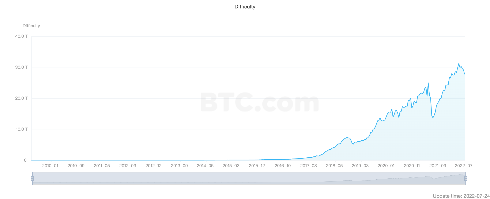

## 序
2022年上半年，加密市场市值一直不停地回调，在7月份，BTC的价格较2021年的最高峰已跌去70%，市场再一次进入“熊市”。不得不说，比特币的价格，以及整个加密资产市场的市值在一定程度上反应了人们对 “加密货币” 的关注程度和风险偏好。从比特币诞生开始，他剧烈的价格波动就成为一个不可避免的话题，本篇笔记并不会构成任何投资建议，任何参与者都应该自行衡量风险与利益。因此，理解与学习 Blockchain 的发展历程，生态与技术背景，才是这篇笔记项目的主要内容。

在文中，如果有参考或相关的链接，都会在相应段落后声明，通常以 ‘--’ 开始标注，强烈建议根据自身的需要，对参考的内容也进行相应的阅读。

## 起点：比特币的诞生
聊起区块链，肯定避免不了谈论比特币，这一切源于2018年11月1日，一个名叫中本聪（Satoshi Nakamoto）的人在密码学邮件组公布了一份比特币白皮书，声称他已经设计好一种“点对点的电子货币系统”。此后中本聪便在邮件组和论坛上与其他人员展开关于这个系统的讨论，在讨论中，中本聪声称他从2017年开始设计并开发这个系统，花了1年半的时间完成了初版的设计与实现。在2009年1月9日，他在SourceForge.net发布了比特币0.01版的源代码，并在这一天开始运行系统，也就是第1个创世区块产生的时间，初始奖励50个BTC。

-- [可在这里找到各个语言版本的比特币白皮书，原版为英文](https://bitcoin.org/en/bitcoin-paper)

-- [Phil Champagne 整理了中本聪早期的留言回复及邮件内容，书名为《区块链启示录：中本聪文集》](https://memoof.me/read/543/epub)

作为一个“点对点的电子货币”，比特币并没有像传统的数字化货币，或是黄金一样容易被大众接受，所以一开始都是一些对加密朋克感兴趣的人参与其中。他们自愿或是为了挖取新的 bitcoin 而运行软件，贡献CPU/GPU资源计算新增区块、打包、广播、存储其他用户的交易，下图可以看出，随着越来越多的矿工加入，系统自动调整难度系数也越来越高，从一开始的 1 到后面最高到 31T 的数量级：

-- [Difficulty Line](https://explorer.btc.com/btc/insights-difficulty?chart=difficulty)

## 区块链2.0：以太坊的崛起

## 最广泛的应用：去中心化金融

## 深入技术：代码上的 web3

## 附：时间线

2007 中本聪开始设计和开发 Bitcoin 系统

2008-11-01 比特币白皮书在密码学邮件组公布

2009-01-09 中本聪在SourceForge.net发布了比特币0.01版的源代码

2009-01-09 比特币第一个区块诞生，初始奖励50BTC
